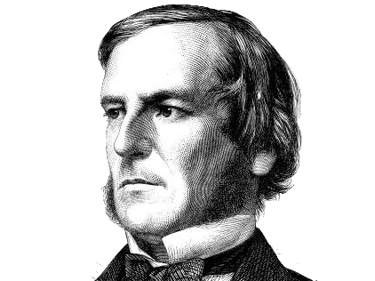

## 「 乔治·布尔：把逻辑变成数学 」

 

    

+ 本章主角：**[乔治·布尔](#welcome)**（George Boole）

+ 生卒：**1815 年 11 月 2 日** - **1864 年 12 月 8 日**

+ 国籍：**英国**

+ 出生地：**英国东部林肯镇**

+ 代表作品：**《关于分析中的一个普遍方法》** | **《逻辑的数学分析——论演绎推理的演算法》** | **《思维的法则》**

+ 誉名：**数学家** | **逻辑学家**

    <a href="..">返回章节目录 ⤴</a>

---

&emsp;&emsp;乔治·布尔（1815 - 1864）出生于英国东部的林肯镇，是莱布尼茨梦想的追随者之一。

    - End -

