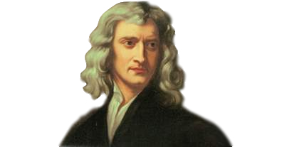

## 「 莱布尼茨：伟大的梦想 」

 

    

+ 本章主角：**戈特弗里德·威廉·[莱布尼茨](#welcome)**（Gottfried Wilhelm Leibniz）

+ 生卒：**1646 年 7 月 1 日** - **1716 年 11 月 14 日**

+ 国籍：**德国**

+ 出生地：**神圣罗马帝国 莱比锡**

+ 代表作品：**《神义论》** | **《单子论》** | **《论中国人的自然神学》**

+ 誉名：**哲学家** | **数学家**

---

&emsp;&emsp;莱布尼茨（1646 - 1716）出生于德国的莱比锡，是德国历史上著名科学家和哲学家，是现代形式逻辑的构设者及初步奠基者。莱布尼茨在青年时代曾经有一个伟大的梦想：把人的理性还原为计算，并且用机器来执行这些计算。他梦想把整个人类知识用一种普遍的人工数学语言和演算规则进行汇编，用数学语言把知识的每一个方面表达出来，用演算规则揭示命题之间的所有的逻辑关系，最后梦想能够制造出机器来完成这写演算。