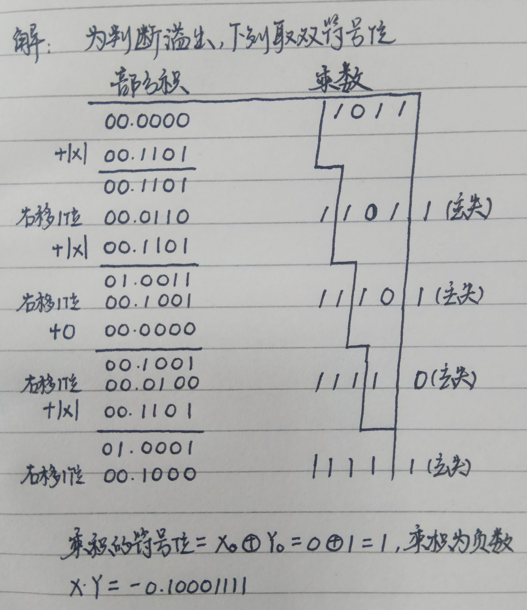
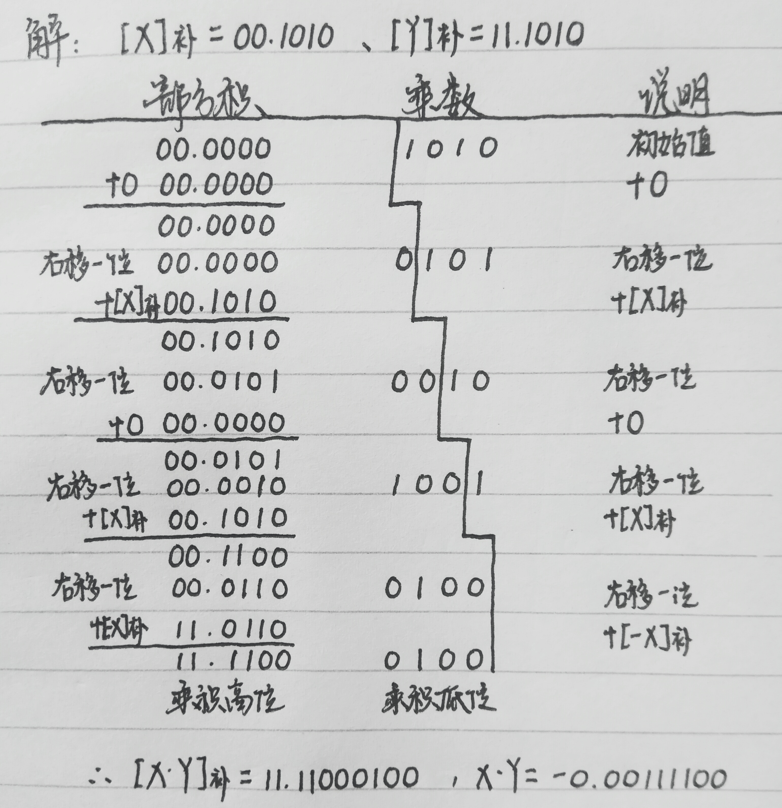
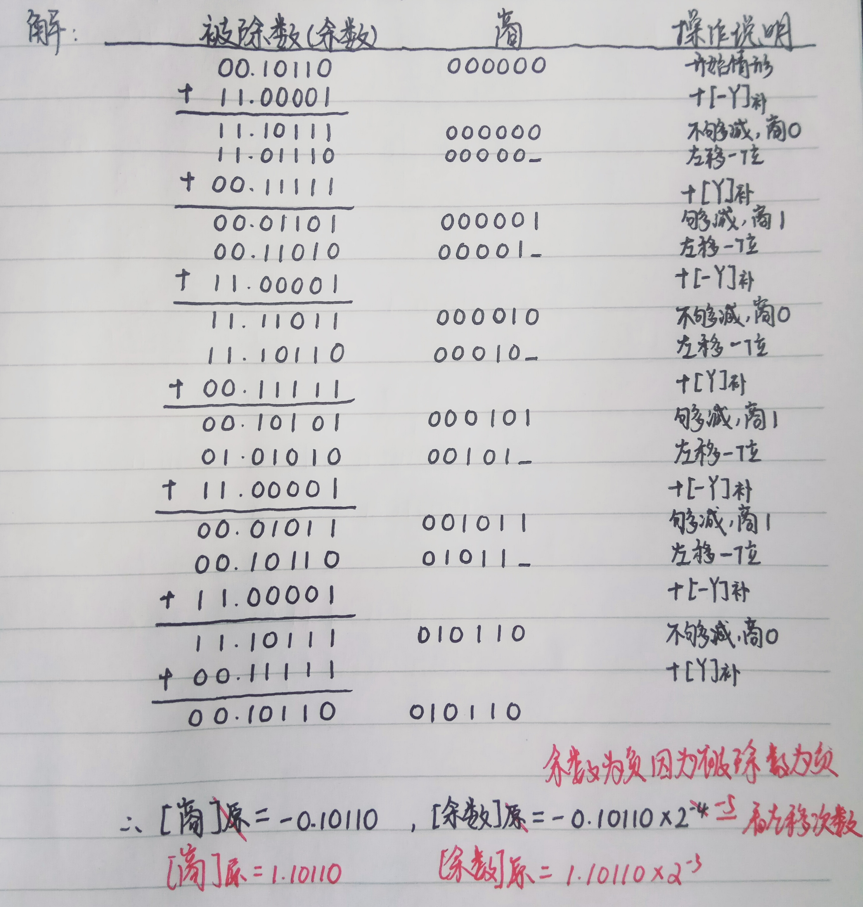
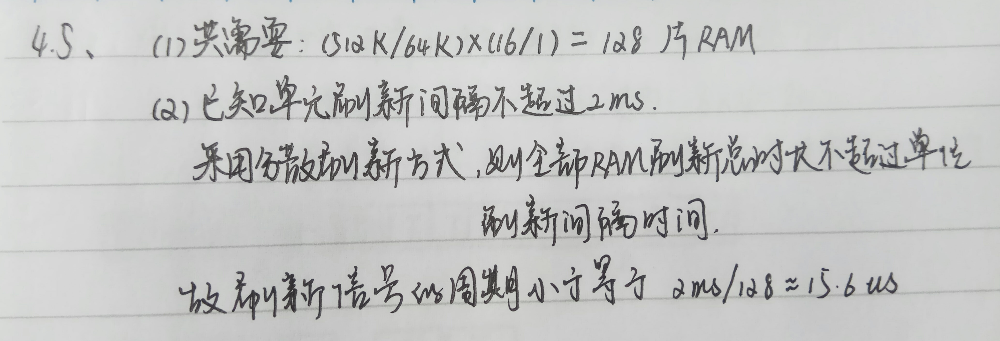
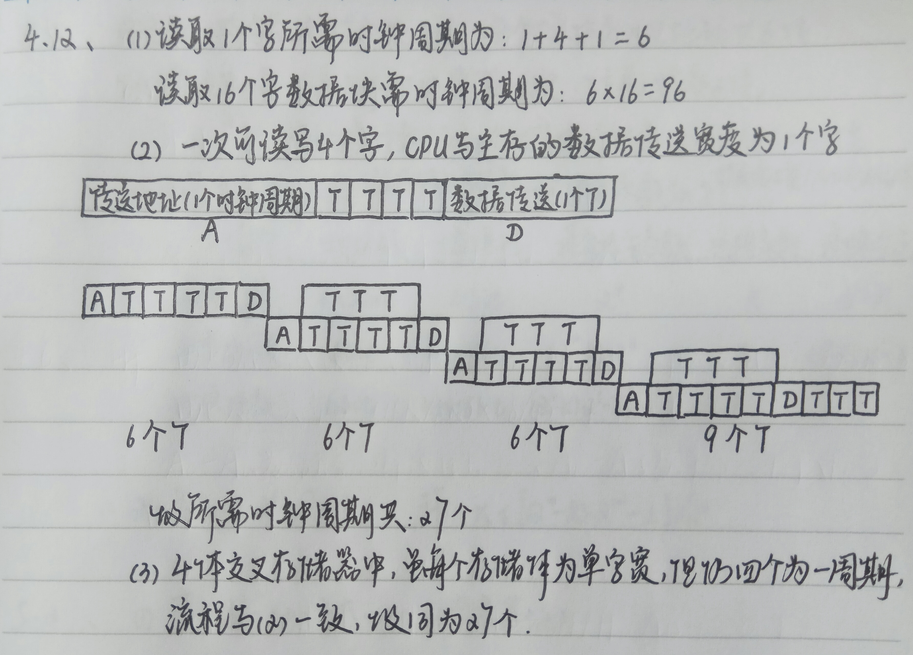
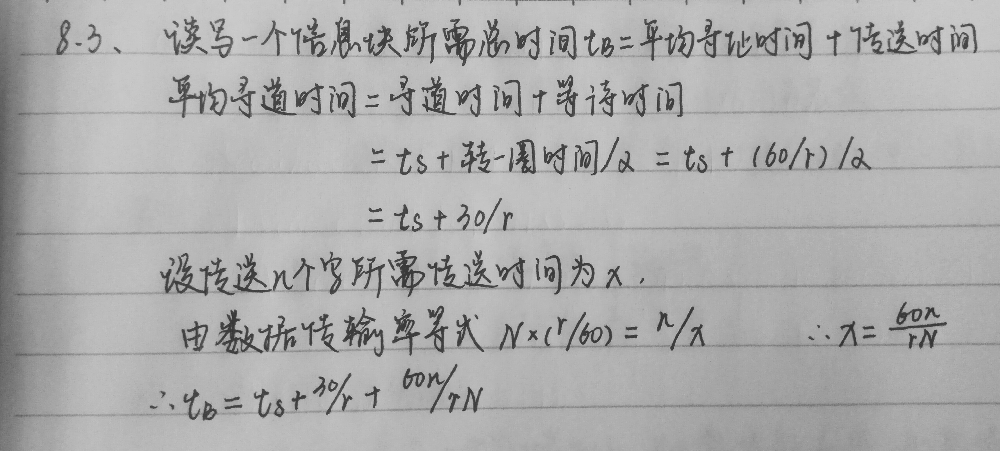
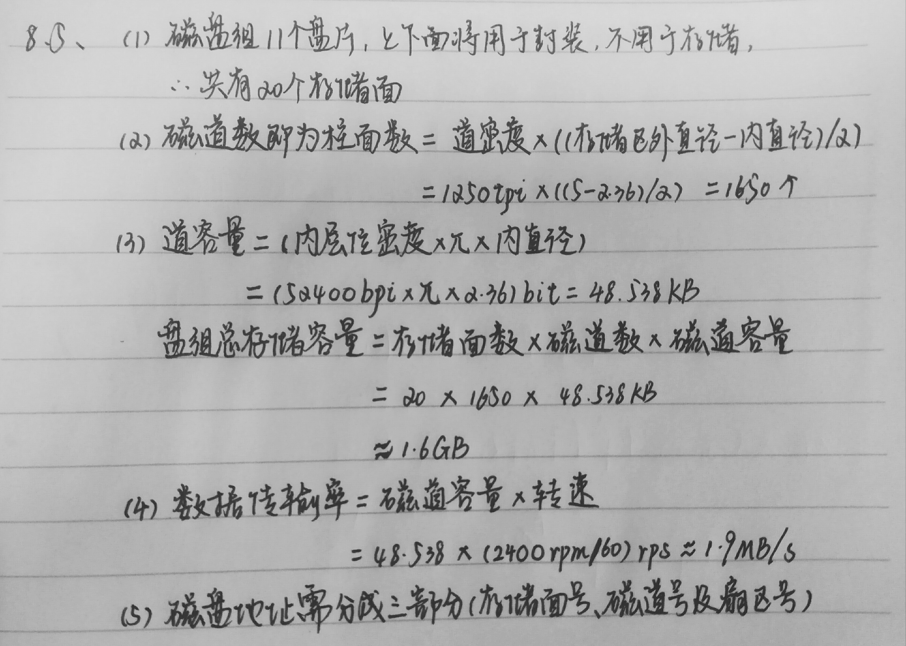
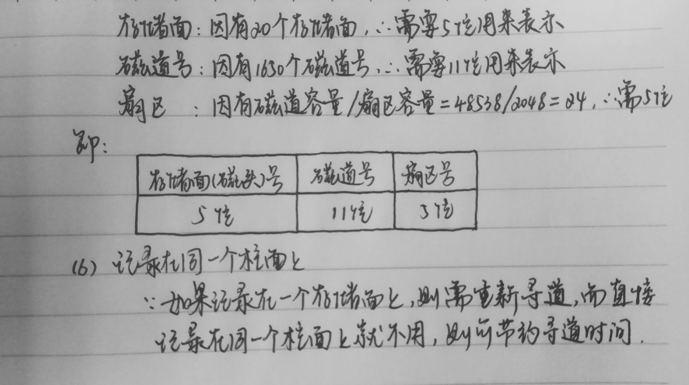

## [《计算机组成与结构》](#welcome)期末突击复习知识点整理📚

 

> *我们只为了 **不挂科** 和 **高分** 做准备！*

 

    

 

&emsp;&emsp;💡 教材选自 《计算机组成与结构》（第5版） 王爱英 主编. 清华大学出版社, 2013. 

 

    

### 📝 考点罗列整理

>> 温馨提示，以下整理知识点均是以临时抱佛脚复习法所用，同学们还是要以书本内容为主啊！

+ **第三章--运算方法和运算部件 考点**
    
  - [原码一位乘](#-原码一位乘)
  
  - [补码一位乘](#-补码一位乘)
  
  - [加减交替法](#-加减交替法)
  
  - [奇偶校验码](#-奇偶校验码)
  
+ **第四章--主存储器 考点**

  - [P71-4.2节 读/写存储器（静态/动态存储器概念、特性、差异）](#-读写存储器)
  
  - [P79-4.3节 非易失性半导体存储器（注意粗体小标题内容）](#-非易失性半导体存储器)
  
  - [P81-4.4节 存储器的组成与控制（字、位、字位扩展；课后例题）](#-存储器的组成与控制)
  
+ **第五章--指令系统 考点**

  - [P89-5.2节 指令格式](#-指令格式)

  - [P93-5.3节 寻址方式](#-寻址方式)
  
  - [P103-5.4.3节 指令系统的兼容性（向上兼容）](#-指令系统的兼容性)
  
  - [P104-5.5.3节 RISC 的特点](#-RISC-的特点)

+ **第六章--中央处理器 考点**

  - [P114-6.1节 控制器的组成（P120加法指令的4条操作）](#-控制器的组成)
  
  - [P121-6.2节 微程序控制计算机的基本工作原理（P125两个图：6.8、6.9）](#-微程序控制计算机的基本工作原理)
  
  - [P130-6.3.1节 微指令控制字段的编译法](#-微指令控制字段的编译法)
  
  - [P134-6.3.3节 微指令格式](#-微指令格式)
  
  - [P142-6.4.2节 操作控制信号的产生（P142结论）](#-操作控制信号的产生)
  
  - [P147-6.5节 流水线工作原理](#-流水线工作原理)

+ **第七章--存储系统 考点**

  - [P166-7.2节 高速缓冲存储器（cache）](#-高速缓冲存储器cache)
  
  - [P171-7.3节 虚拟存储器](#-虚拟存储器)
  
  - [P177-7.4节 相联存储器](#-相联存储器)
  
+ **第八章--辅助存储器 考点**

  - [第八章课后例题](#-课后例题)
  
+ **第十章 输入输出（I/O）系统**

  - [P230-10.1.2节 I/O 设备数据传送控制方式](#-IO-设备数据传送控制方式)
  
  - [P231-10.2节 程序中断输入输出方式](#-程序中断输入输出方式)
  
  - [P237-10.3节 DMA 输入输出方式](#-DMA-输入输出方式)
  
  - [P240-10.4节 I/O 通道控制方式](#-IO-通道控制方式)
  
  - [P241-10.5节 总线结构](#-总线结构)

 

    
    <h2>第三章 -- 运算方法和运算部件</h2>

    <a href="#-考点罗列整理">返回顶端目录⬆</a>

#### 🔍 原码一位乘

    
【例题3.17】用原码一位乘计算 X = 0.1101 和 Y = -0.1011 的积 X·Y。（点击查看答案）

     
    
     

  
#### 🔍 补码一位乘

    
【例题3.18】用补码一位乘计算 X = 0.1010 和 Y = -0.0110 的积 X·Y。（点击查看答案）

     
    
     

#### 🔍 加减交替法

    
【例题3.19】X = -0.10110，Y = 0.11111，用加减交替法原码一位除计算 X/Y 的商及余数。（点击查看答案）

     
    
     

#### 🔍 奇偶校验码

    
【例题3.25】如果采用偶校验，下述两个数据的校验位的值是什么？（点击查看答案） &emsp;&emsp;（1） 0101010&emsp;&emsp;（2）0011011

     
    <a href="#welcome">答：采用偶校验即有效信息位数值 1 的个数加上校验位数值 1 的个数要为偶数个。</a> &emsp;&emsp;<a href="#welcome">（1）中，有效信息位数值 1 的个数为3，所以校验位为 1，方能补齐偶数个数值 1。同理（2）校验位为 0。</a>
     

 

    
    <h2>第四章 -- 主存储器</h2>

    <a href="#-考点罗列整理">返回顶端目录⬆</a>

### 🔍 读/写存储器

+ 静态存储器 SRAM 和动态存储器 DRAM 各自的特点

||SRAM|DRAM|
|:--:|:--:|:--:|
|存储信息|触发器|电容|
|破坏性读出|非|是|
|需要刷新|不要|需要|
|送行列地址|同时送|分两次送|
|运行速度|快|慢|
|集成度|低|高|
|发热量（功耗）|大|小|
|存储成本|高|低|
|主要用途|高速缓存|主机内存|

### 🔍 非易失性半导体存储器

&emsp;&emsp;SRAM 和 DRAM 均属于易失性存储器，掉电所储信息会立即消失；非易失性半导体存储器掉电所存储信息也不会丢失。下面为其种类：

+ 只读存储器（ROM）

+ 可编程序的只读存储器（PROM）

+ 可擦可编程序的只读存储器（EPROM）

+ 可电擦可编程序只读存储器（E²PROM）

+ 快擦除读写存储器（Flash Memory）

|存储器名|功能|存储原理|存储单元元件|
|:--:|:--:|:--:|:--:|
|ROM|只读不能写|以元件有无表示0、1|二极管或晶体管|
|PROM|一次性写入|以熔丝接通、断开表示0、1|熔丝|
|EPROM|可多次写入、读出|写:以漏源极间有无导电沟道存储0、1 擦:紫外线使浮置栅电荷泄漏|如P80所示管子|
|E²PROM|可多次读出但写入次数有限|写：同EPROM 擦：电擦除|两个晶体管|
|Flash Memory|重复写入、读出|写：同EPROM 擦：电一次性整体或分区擦除|同EPROM|

### 🔍 存储器的组成与控制

&emsp;&emsp;主存储器通过数据总线、地址总线和控制总线与 CPU 连接。地址总线的位数决定了可寻址的最大内存空间。由于单个存储芯片容量有限，因此需要在字和位两方面进行扩充才能满足实际存储器的容量要求。通常采用**位扩展法**、**字扩展法**、**字位同时扩展法**来扩展主存容量。

💡 **[如何确定芯片的地址线位数和数据线位数？](#question)**

**答：** 如一片 16Kx8 位的存储芯片，其地址范围 16K=214，需要 14 位二进制位来表示，即地址线位数为 14。其中数据位数即为 16Kx8 的数字量 8
，即数据线位数为 8。

+ 位扩展法

+ 字扩展法

+ 字位同时扩展法

#### 课后例题

    
【例题4.5】有一个 512Kx16 的存储器，由 64Kx1 位的 2164RAM 芯片构成（芯片内是 4 个 128x128 结构），问：（点击查看答案） （1）总共需要多少个 RAM 芯片？ （2）采用分散刷新方式，如单元刷新间隔不超过 2ms，则刷新信号的周期是多少？

     
    
     

    
【例题4.6】某机器中，已知有一个地址空间为 0000H~1FFFH 的 ROM 区域，现在再用 RAM 芯片（8Kx4）形成一个 16Kx8 的 RAM 区域，起始地址为 2000H，假设 RAM 芯片有 CS 和 WE 信号控制端。CPU 地址总线为 A15~A0，数据总线为 D7~D0，控制信号为 R/W（读和写）和 MREQ（当存储器进行读或写操作时，该信号指示地址总线上的地址是有效的）。要求画出逻辑图。（点击查看答案）

     
    
     

    
【例题4.10】设有一 4 体交叉存储器，但使用时经常遇到连续访问同一存储体的情况，会产生怎样的结果？（点击查看答案）

     
    <a href="#welcome">答：会使存储带宽降低，从而降低存储器效率。在特殊情况下，就像只有一个存储器。</a>
     

    
【例题4.12】设某主存储器访问一次存储器的时间如下：传送地址 1 个时钟周期，读/写 4 个时钟周期，数据传送 1 个时钟周期，采用下述 3 种主存结构读取 16 个字的数据块，各需多少时钟周期？（点击查看答案） （1）单字宽主存，一次只能读/写 1 个字。 （2）4 字宽主存，一次可读写 4 个字，但 CPU 与主存的数据传送宽度为 1 个字。 （3）4 体交叉存储器，每个存储体为单自宽。

     
    
     

 

    
    <h2>第五章 -- 指令系统</h2>

    <a href="#-考点罗列整理">返回顶端目录⬆</a>

### 🔍 指令格式

&emsp;&emsp;指令（又称机器指令）是指示计算机执行某种操作的命令，是计算机运行的最小功能单元。一台计算机的所有指令的集合构成该机的指令系统，也称指令集。

&emsp;&emsp;一条指令通常包括**操作码字段**和**地址码字段**两部分：
+ 操作码指出指令中该指令应该执行什么性质的操作和具有何种功能

+ 地址码给出被操作的信息（指令或数据）的地址

&emsp;&emsp;指令的长度是指一条指令中所包含的二进制代码的位数，指令字长取决于操作码的长度、操作地址码的长度和操作数地址的个数。

### 🔍 寻址方式

&emsp;&emsp;寻址方式是指寻找指令或操作数有效地址的方式。

&emsp;&emsp;指令中的地址码字段并不代表操作数的真实地址，这种地址称为形式地址（A）。形式地址结合寻址方式，可以计算出操作数在存储器中的真实地址，这种地址称为有效地址（EA）。

|寻址方式|有效地址|访存次数|
|:--:|:--:|:--:|
|直接寻址|EA = A|1|
|寄存器寻址|EA = Ri|0|
|基址寻址|EA = (BR)+A|1|
|变址寻址|EA = (IX)+A|1|
|间接寻址|EA = (A)|2|
|相对寻址|EA = (PC)+A|1|
|立即数寻址|A 即是操作数|0|
|堆栈寻址|EA = 基址寄存器内容+变址寄存器内容+A（指令地址码）|1|
  
### 🔍 指令系统的兼容性

&emsp;&emsp;当研制系列计算机的新型号或高档产品时，尽管指令系统可以有较大的扩充，但仍保留原来的全部指令，保持软件**向上兼容**的特点，即低档机或旧型机上的软件不加修改即可在新机器上运行，以保护用户在软件上的投资。

### 🔍 RISC 的特点

&emsp;&emsp;精简指令系统计算机（RISC）的中心思想是**要求指令系统简化**，尽量使用寄存器-寄存器操作指令，指令格式力求一致。RISC 的主要特点如下：
+ 选取[使用频率最高的一些简单指令](#welcome)，[复杂指令的功能由简单指令的组合来实现](#welcome)。

+ [指令长度固定](#welcome)，[指令格式种类少](#welcome)，[寻址方式种类少](#welcome)。

+ [只有 Load。Store（取数/存数）指令访存](#welcome)，其余指令的操作都在寄存器之间进行。

+ CPU 中[通用寄存器的数量相当多](#welcome)。

+ RISC [一定采用指令流水线技术](#welcome)，大部分指令在[一个时钟周期内完成](#welcome)。

+ [以硬布线控制为主](#welcome)，[不用或少用微程序控制](#welcome)。

+ 特别重视[编译优化](#welcome)工作，以减少程序执行时间。

 

    
    <h2>第六章 -- 中央处理器</h2>

    <a href="#-考点罗列整理">返回顶端目录⬆</a>

### 🔍 控制器的组成

&emsp;&emsp;控制器是整个系统的指挥中枢，在控制器的控制下，使运算器、存储器和输入/输出设备等功能部件构成一个有机的整体，根据指令的要求指挥全机协调工作。控制器的基本功能是执行指令，每条指令的执行是由控制器发出的一组微操作实现的。

&emsp;&emsp;控制器有**硬布线控制器**和**微程序控制器**两种类型。

&emsp;&emsp;控制器由[程序计数器（PC）](#welcome)、[指令寄存器（IR）](#welcome)、[指令译码器](#welcome)、[存储器地址寄存器（MAR）](#welcome)、[存储器数据寄存器（MDR）](#welcome)、[时序系统](#welcome)和[微操作信号发生器](#welcome)等组成。

|部件名|功能与作用|
|:---:|:-------:|
|程序计数器|用于指出下一条指令在主存中的存放地址。 CPU 根据 PC 的内容去主存中取指令。 因程序中指令（通常）是顺序执行的，所以 PC 有自增功能|
|指令寄存器|用于保存当前正在执行的那条指令|
|指令译码器|仅对操作码字段进行译码，向控制器提供特定的操作信号|
|存储器地址寄存器|用于存放所要访问的主存单元的地址|
|存储器数据寄存器|用于存放向主存写入的信息或从主存中读出的信息|
|时序系统|用于产生各种时序信号，它们都由统一时钟（CLOCK）分频得到|
|微操作信号发生器|根据 IR 的内容（指令）、PSW 的内容（状态信息）及时序信号， 产生控制整个计算机系统所需的各种控制信号， 其结构有组合逻辑型和存储逻辑型两种|

✏ **[加法指令的完成操作如下：](#welcome)**

+ （1）第一个机器周期：**取指令**

  - 从存储器取指令，送入指令寄存器，并进行操作码译码（分析指令）。
  - 程序计数器加 1，为下一条指令作好准备。
  - 控制器发出的控制信号：PC → AB，W/R = 0，M/IO = 1；DB → IR；PC + 1。
  
+ （2）第二个机器周期：**计算地址**

  - 在 ALU 计算数据地址，将计算得到的有效地址送地址寄存器 AR。
  - 控制器发出的控制信号：rsl → GR，(rsl) → ALU，disp → ALU（将 rsl 的内容与 disp 送 ALU）；“+”（加法命令送 ALU）；ALU → AR（有效地址送地址寄存器）。
  
+ （3）第三个机器周期：**取数**

  - 到存储器取数
  - 控制器发出的控制信号：AR → AB，W/R = 0，M/IO = 1；DB → DR（将地址寄存器内容送地址总线，同时发访存读命令，存储器读出数据送数据总线后，打入数据寄存器）。
  
+ （4）第四个机器周期：**运算送结构**

  - 进行加法运算，结果送寄存器，并根据运算结果置状态位 N、Z、V、C。
  - 控制器送出的控制信号：rs → GR，(rs) → ALU，DR → ALU（两个源操作数送 ALU）；“+”（ALU 进行加法运算）；rd → GR，ALU → rd，置 N、Z、V、C（结果送寄存器，并置状态位）。

### 🔍 微程序控制计算机的基本工作原理

&emsp;&emsp;微程序设计思想就是将每条机器指令编写成一个微程序，每个微程序包含若干微指令，每条微指令对应一个或几个微操作命令。这些微程序可以存到一个控制存储器中，用寻址用户程序机器指令的办法来寻址每个微程序中的微指令。目前，大多数计算机都采用微程序设计技术。

+ 微程序流程图举例

+ 微程序控制器简化框图

### 🔍 微指令控制字段的编译法

+ [直接控制法](#welcome)

&emsp;&emsp;在微指令的控制字段中，每一位代表一个微命令，在设计微指令时，是否发出某个微命令，只要将控制字段中相应位置成 1 或 0，这样就可打开或关闭某个控制门，这就是直接控制法。 

+ [字段直接编译法](#welcome)

&emsp;&emsp;将微指令的微命令字段分成若干小字段，把互斥性微命令组合在同一字段中，把相容性微命令组合在不同字段中，每个字段独立编码，每种编码代表一个微命令且各字段编码含义单独定义，与其他字段无关，这就是字段直接编译法。

+ [字段间接编译法](#welcome)

&emsp;&emsp;一个字段的某些微命令需由另一个字段中的某些微命令来解释，由于不是靠字段直接译码发出的微命令，故称为字段间接编码，又称隐式编码。这种方式可进一步缩短微指令字长，但因削弱了微指令的并行控制能力，因此通常作为字段直接编码方式的一种辅助手段。

### 🔍 微指令格式

&emsp;&emsp;微指令的格式大体上可分成两类，一是**水平型微指令**；二是**垂直型微指令**。

+ [水平型微指令](#welcome)

  - 直接控制法就属于水平型微指令的典型例子，其特点是在一条微指令中定义并执行多个并行操作微命令。
  - 实际应用中，直接控制法、字段编译法（直接、间接编译法）经常应用在同一条水平型微指令中。
  
+ [垂直型微指令](#welcome)

  - 在微指令中设置有微操作码字段，由微操作码规定微指令的功能
  - 特点是不强调实现微指令的并行控制功能，通常一条微指令只要求能控制实现一二种操作。
  - 这种微指令格式与指令相似，每条指令有一个操作码、每条微指令有一个微操作码。
  
+ [水平型微指令与垂直型微指令的比较](#welcome)

  - 水平型微指令并行操作能力强，效率高，灵活性强，垂直型微指令则差。
  - 水平型微指令执行一条指令的时间短，垂直型微指令执行时间长。
  - 由水平型微指令解释指令的微程序，具有微指令字比较长，但微程序短的特点。垂直型微指令则相反，微指令字比较短而微程序长。
  - 水平型微指令用户难以掌握，需要用户掌握控制信号，而垂直型微指令与指令比较相似，相对来说比较容易掌握。

### 🔍 操作控制信号的产生

&emsp;&emsp;（1）取指周期 cy1 所产生的信号对所有指令都是相同的，即与当前执行的指令无关，逻辑式得到最简单的形式。

&emsp;&emsp;（2）通常，同一个控制信号在若干条指令的某些周期（或再加上一些条件）种都需要，为此需要把它们组合起来。

&emsp;&emsp;例如，“+” 命令在加法指令的 cy2（计算有效地址）与 cy4（操作数相加）时需要，在减法指令的 cy2（计算有效地址）时需要，在转移指令的 cy2（计算转移地址）时需要，……。

&emsp;&emsp;用逻辑式表示如下： &emsp;&emsp;“+” = 加法指令（cy2 + cy4）+ 减法指令·cy2 + 转移指令·cy2 + …… &emsp;&emsp;&emsp;&ensp;= 加法指令·cy2 + 加法指令·cy4 + 减法指令·cy2 + 转移指令·cy2 + ……

### 🔍 流水线工作原理

&emsp;&emsp;计算机的流水线把一个重复的过程分解为若干子过程，每个子过程与其他子过程并行执行。由于采用流水线技术只需增加少量硬件就能把计算机的运算速度提高几倍，因此成为计算机中普遍使用的一种并行处理技术。

 

    
    <h2>第七章 -- 存储系统</h2>

    <a href="#-考点罗列整理">返回顶端目录⬆</a>

### 🔍 P166-7.2节 高速缓冲存储器（cache）

&emsp;&emsp;根据局部性原理，在主存和 CPU 之间设置了 cache。如果当前正在执行的程序和数据存放在 cache 中，当程序运行时，不必从主存储器取指令和取数据，访问 cache 即可。cache 一般由 SRAM 组成。

&emsp;&emsp;为了把信息存放到 cache 中，必须应用某种函数把主存地址映像到 cache，称作地址映射。最基本的几种地址映像方式有：**直接映像**、**全相联映像**和**组相联映像**。

+ 直接映射

+ 全相联映射

+ 组相联映射

### 🔍 P171-7.3节 虚拟存储器

&emsp;&emsp;虚拟存储器指的是“主存-辅存”层次，程序员可以按虚存空间编址。

### 🔍 P177-7.4节 相联存储器

&emsp;&emsp;相联存储器不按地址访问存储器，而按所存数据字的全部内容或部分内容进行查找（或检索）。例如，在虚拟存储器中，将虚地址的虚页号与相联存储器中所有行的虚页号进行比较，若有内容相等的行，则将其相应的实页号取出，这是按数据字的部分内容进行检索的例子。

 

    
    <h2>第八章 -- 辅助存储器</h2>

    <a href="#-考点罗列整理">返回顶端目录⬆</a>

### 🔍 课后例题

    
【例题8.3】假设某磁盘存储器的平均找道时间为 ts，转速为每分钟 r 转，每磁道容量为 N 个字，每信息块为 n 个字。试推导写出一个信息块所需总时间 tB 的计算公式。（点击查看答案）

     
    
     

    
【例题8.5】假设磁盘组有 11 个盘片，每片有两个记录面；存储区域内直径 2.36in，外直径 5.00in；道密度为 1250tpi，内层位密度为 52400bpi，转速为 2400rpm。问：（点击查看答案） （1）共有多少个存储面可用？ （2）共有多少柱面？ （3）每道存储多少字节？盘组总存储容量是多少？ （4）数据传输率是多少？ （5）每扇区存储 2KB 数据，在寻址命令中如何表示磁盘地址？ （6）如果某文件长度超过了一个磁道的容量，应将它记录在同一个存储面上，还是记录在同一个柱面上？

     
     
    
     

    
【例题8.9】填空：（点击查看答案） （1）一个完整的磁盘存储器由______3 部分组成。其中______又称磁盘机，是独立于主机的一个完整设备，______通常是插在主机总线插槽中的一块电路板，______是存储信息的介质。 （2）驱动器的定位驱动系统实现______；主轴系统的作用是______；数据控制系统的作用是控制数据的写入和读出，包括______等。 （3）磁盘控制器有两个方向的接口，一是与______的接口，与主机总线打交道，控制辅存与主机之间交换数据；另一个方向是与______的接口，根据主机命令控制磁盘驱动器操作。 （4）光盘的读写头即光学头比硬盘的磁头______。光盘的定位速度______，即找道时间______。光盘写入时盘片需旋转 3 圈，以分别实现______，故光盘的速度______硬盘。

     
    <a href="#welcome">（1）驱动器、控制器和盘片；驱动器；控制器；盘片</a> <a href="#welcome">（2）快速且精确的磁头定位；固定盘片并带动盘片按额定转速稳定地旋转；电流控制、读出放大、寻址控制、磁头选择、数据分离</a> <a href="#welcome">（3）主机；驱动器</a> <a href="#welcome">（4）大、重；慢；长；擦除、写入和检验</a>
     

 

    
    <h2>第十章 -- 输入输出（I/O）系统</h2>

    <a href="#-考点罗列整理">返回顶端目录⬆</a>

### 🔍 P230-10.1.2节 I/O 设备数据传送控制方式

&emsp;&emsp;在输入/输出系统中，经常需要进行大量的数据传输，而传输过程中有各种不同的 I/O 控制方式，基本的控制方式分为 5 种：

+ [程序直接控制方式](#welcome)

+ [程序中断传送方式](#welcome)

+ [直接存储器存取方式](#welcome)

+ [I/O 通道控制（I/O channel control）方式](#welcome)

+ [外围处理机方式](#welcome)

### 🔍 P231-10.2节 程序中断输入输出方式

### 🔍 P237-10.3节 DMA 输入输出方式

### 🔍 P240-10.4节 I/O 通道控制方式

### 🔍 P241-10.5节 总线结构

 

    

&emsp;&emsp; 写在最后：大家一起加油吧！ >_<

   
