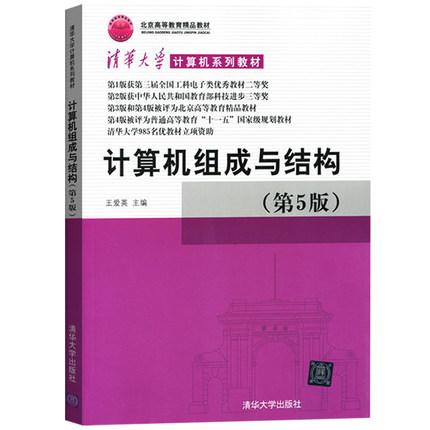
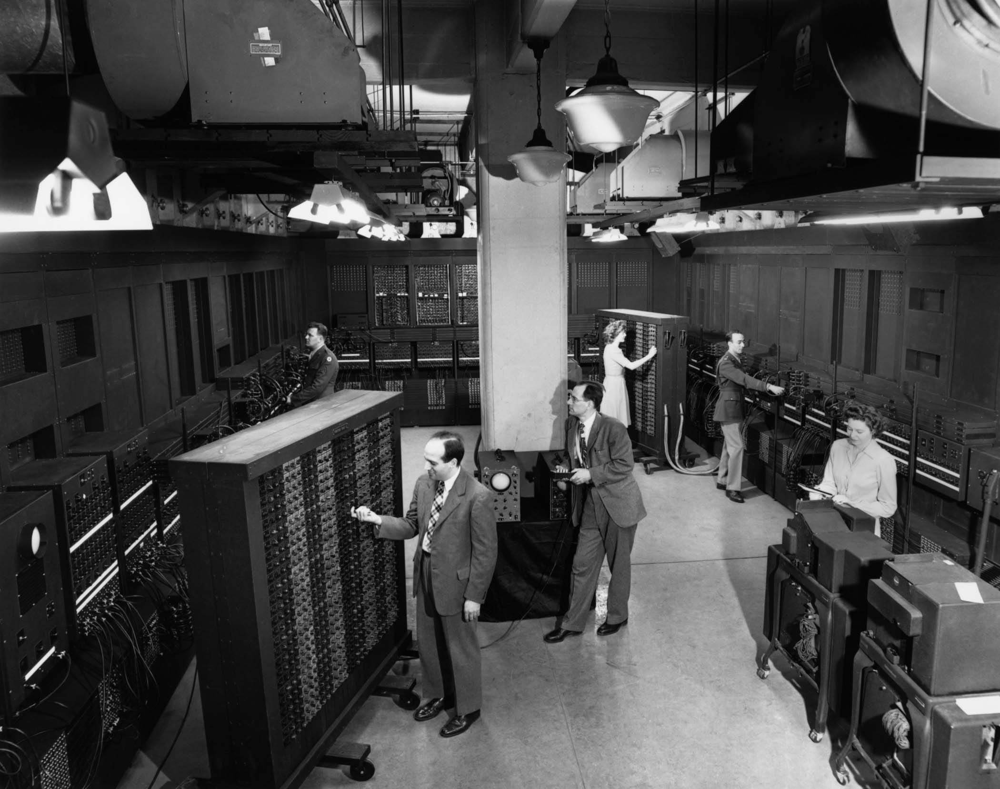
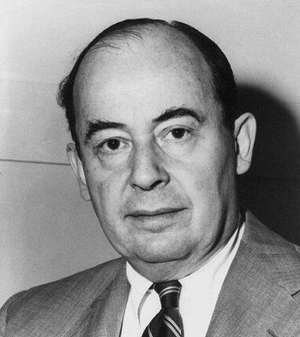
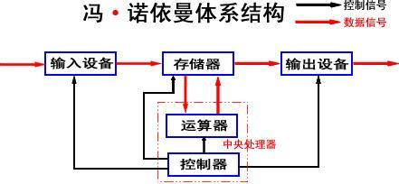
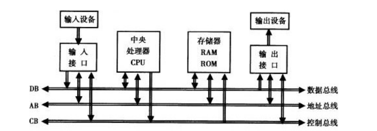
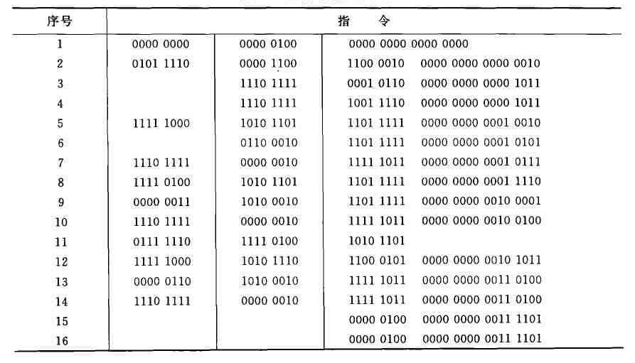
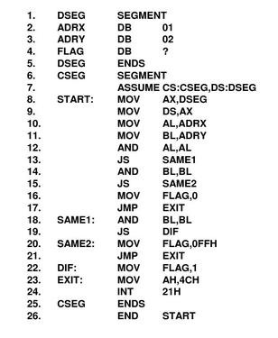
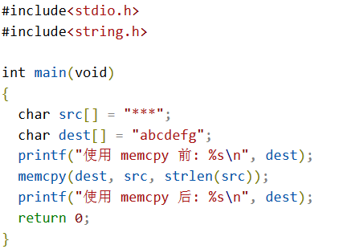
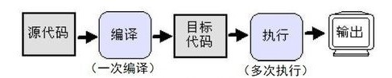
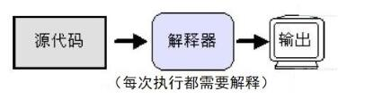

## [《计算机组成原理》](#welcome)知识点深度讲解📚

 

> *一切为了 **技术** 和 **考研** 而努力！*

 

    

 

&emsp;&emsp;💡 主要参考教材选自 《计算机组成与结构》（第5版） 王爱英 主编. 清华大学出版社, 2013. 

 

    

### 📝 知识点目录

>> 温馨提示，部分知识点顺序未参考书本目录顺序，教材只做参考。

+ [**第一节--计算机系统概述**](#第一节--__-计算机系统概述-__)
    
  - [计算机的诞生和发展](#-计算机的诞生和发展)
  
  - [计算机的硬件](#-计算机的硬件)
  
  - [计算机的软件](#-计算机的软件)
  
  - [计算机网络基础](#-计算机网络基础)
  
+ [**第二节--数据的表示及运算方法**](#第二节--__-数据的表示及运算方法-__)

+ [**第三节--计算机存储系统**](#第三节--__-计算机存储系统-__)

+ [**第四节--指令系统**](#第四节--__-指令系统-__)

+ [**第五节--中央处理器 CPU**](#第五一节--__-中央处理器-__)

+ [**第六节--总线**](#第六节--__-总线-__)

+ [**第七节--输入/输出系统**](#第七节--__-输入/输出系统-__)

+ [**第八节--扩展知识内容**](#第八节--__-扩展知识内容-__)

 

    
    <h2>第一节 . __ 计算机系统概述 __</h2>

    <a href="#-知识点目录">返回目录⬆</a>

### 💬 计算机的诞生和发展

&emsp;&emsp;1946 年 2 月 14 日，世界上第一台电子计算机诞生。它是由美国宾夕法尼亚大学于 1943-1946 年间研制的电子数字积分器和计算机 [ENIAC](#welcome)（electronic numerical integrator and computer）。当时历史背景处在第二次世界大战中，美国军方为解决新武器弹道问题的复杂计算而资助了美国宾夕法尼亚大学投入研究，从而 ENIAC 计算机于 1946 年 2 月正式交付使用，是现代计算机的始祖。

 世界上第一台电子计算机——ENIAC
 

&emsp;&emsp;与 ENIAC 计算机研制的同时，1945 年 6 月，**冯·诺依曼（von Neumann）** 提出了在数字计算机内部的存储器中存放程序的概念，这也是后面所有现代电子计算机的模板，称为“冯·诺依曼结构”。1944 年的夏天，正在火车站候车的冯·诺依曼巧遇戈尔斯坦，当时戈尔斯坦是美国弹道实验室的军方负责人，他正参与 ENIAC 计算机的研制工作。冯·诺依曼在于戈尔斯坦的交谈中，戈尔斯坦告诉了冯·诺依曼有关 ENIAC 的研制情况，冯·诺依曼被此研制计划所吸引。后冯·诺依曼由 ENIAC 机研制组的戈尔德斯廷中尉介绍参加 ENIAC 机研制小组，这一批富有创新精神的年轻科技人员便向着更高的目标进军。1945 年，他们在共同讨论的基础上，发表了一个全新的“存储程序通用电子计算机方案”--[EDVAC](#welcome)（electronic discrete variable automatic computer），也称为冯·诺依曼型计算机。

 被誉为计算机之父的冯·诺依曼
 

&emsp;&emsp;EDVAC 设计思想之一是 [二进制](#welcome)，冯·诺依曼根据电子元件的工作特点，建议在电子计算机中采用二进制。报告方案还提到了二进制的优点，并预言，二进制的采用将大大简化机器的逻辑线路。一般认为冯·诺依曼型计算机具有如下基本特点： 
&emsp;&emsp;（1）计算机由 [运算器](#welcome)、[控制器](#welcome)、[存储器](#welcome)、[输入设备](#welcome) 和 [输出设备](#welcome) 5 部分组成。 
&emsp;&emsp;（2）采用存储程序的方式，程序和数据放在同一个存储器中，并以二进制表示。 
&emsp;&emsp;（3）指令由操作码和地址码组成。 
&emsp;&emsp;（4）指令在存储器中按执行顺序存放，由指令计数器（即程序计数器 PC）指明要执行的指令所在的存储单元地址，一般按顺序递增，但可按运算结果或外界条件而改变。 
&emsp;&emsp;（5）机器以 [运算器](#welcome) 为中心，输入输出设备与存储器间的数据传送都通过运算器。

 冯·诺依曼体系结构
 

&emsp;&emsp;根据电子计算机所采用的 [物理器件](#welcome) 的发展，一般把电子计算机的发展分成 5 个阶段，习惯上称为 5 代。相邻两代计算机之间时间上有重叠。

&emsp;&emsp;第一代：电子管计算机时代（从 1946 年第一台计算机研制成功到 20 世纪 50 年代后期）。

&emsp;&emsp;第二代：晶体管计算机时代（从 20 世纪 50 年代中期到 60 年代后期）。

&emsp;&emsp;第三代：集成电路计算机时代（从 20 世纪 60 年代中期到 70 年代前期）。

&emsp;&emsp;第四代：大规模集成电路计算机时代。20 世纪 70 年代初，半导体存储器问世，迅速取代了磁芯存储器，并不断向大容量、高速度发展。此后，半导体芯片集成度大体上每 18 个月翻一番，这就是著名的 **摩尔定律**。

&emsp;&emsp;第五代：超大规模集成电路（VLSI，ULSI）计算机时代。

> 计算机的发展历程不作详细描述了，有兴趣的可以查阅相关资料了解。

### 💬 计算机的硬件

&emsp;&emsp;组成计算机的基本部件有 [中央处理器](#welcome)（CPU，[运算器](#welcome) 和 [控制器](#welcome)）、[存储器](#welcome) 和 [输入输出设备](#welcome)。

&emsp;&emsp;输入设备比如鼠标、键盘，用来输入原始数据和处理这些数据的程序。人们常用 8 位二进制码表示一个数字、一个字母或其他符号，当前通用的是 ASCII 码，它由 7 位二进制码表示一个字符。在计算机中一般把 8 位二进制码称为一个字节，最高的一位可用于奇偶校验或其他用处。

&emsp;&emsp;输出设备用来输出计算机的处理结果，可以是数字、字母、表格或图形图像等，最常用的输入输出设备是显示器和打印机。

&emsp;&emsp;存储器用来存放程序和数据，存储器又有主存储器和辅助存储器之分。主存储器是计算机各种信息的存储和交流中心，可与 CPU、输入输出设备交换信息，起存储、缓冲和传递信息的作用。当前正在计算机上运行的程序和数据是存放在主存储器中的。

&emsp;&emsp;中央处理器又叫 CPU，在早期的计算机中分成运算器和控制器两部分，由于电路集成度的提高，早已把它们集成在一个芯片中。运算器是对信息或数据进行处理和运算的部件，经常进行的是算术运算和逻辑运算，所以在其内部有一个算术及逻辑运算部件（ALU）。控制器主要用来实现计算机本身运行过程的自动化，即实现程序的自动执行。

&emsp;&emsp;在计算机中，各部件间的信号来往可分成 3 种类型，即 [地址](#welcome)、[数据](#welcome) 和 [控制信号](#welcome)。通常这些信号是通过 [总线](#welcome) 传送的。

 以总线连接的计算机框图
 

### 💬 计算机的软件

&emsp;&emsp;早期，计算机的使用者必须用二进制码表示的指令编写程序，称为 [机器语言程序](#welcome)。在 20 世纪 50 年代，出现了符号式程序设计语言，称为 [汇编语言](#welcome)，程序员可用 ADD、SUB、MUL、DIV 等符号分别表示加法（add）、减法（subtraction）、乘法（multiplication）、除法（division）的操作码，并用符号来表示指令和数据的地址。当然，汇编语言可不是我们计算机能直接识别的，我们计算机能看懂的只是流动的二进制码数据。所以，在执行汇编语言程序时，计算机需要将它翻译成对应的机器语言（二进制代码），然后再运行。

&emsp;&emsp;其中，机器语言和汇编语言都属于我们计算机编程语言，然而，更为我们熟悉的是另一种语言——[高级语言](#welcome)。所以按层次来分，编程语言分为 3 类：[机器语言](#welcome)、[汇编语言](#welcome) 和 [高级语言](#welcome)。高级语言又主要是相对于汇编语言而言的，它不是特指某一种具体的语言，而是包括很多编程语言，比如 java、C、C++、C#、python 等，它的特点是语法和结构比较接近自然语言，更类似于汉字或普通英文，比较远离对硬件的直接操作。机器语言是用二进制代码表示的计算机能直接识别和执行的一种机器指令的集合。它是计算机的设计者通过计算机的硬件结构赋予计算机的操作功能。汇编语言本质上也是直接对硬件操作，由于采用了助记符，相比机器语言更加方便书写与阅读。

 机器语言程序示例
 

 汇编语言程序示例
 

 高级语言（C语言）程序示例
 

&emsp;&emsp;在高级语言编写的程序中，（大部分）编译器需要将其翻译成汇编语言，然后再交由计算机硬件执行（常见的此高级语言有 C 语言和 C++ 语言等）。这里有一个小问题值得思考。

 

💡 **[为什么（大部分）高级语言的编译器会将高级语言程序翻译成汇编语言而不是直接翻译成机器语言？](#welcome)**

**答：** ① 编译器也是软件应用程序，在写编译器程序过程中也会存在许多需要优化和调试的地方。而汇编语言是机器指令的助记符，一个汇编指令就对应一条机器指令（特殊指令除外），调试起来会比机器指令方便得多，优化时也会更方便； &emsp;&emsp; ② 汇编代码到机器码的转换是由硬件实现的，所以高级语言只需要编译成汇编代码就可以，这样的分层实现可以有效地减弱编译器的编写复杂性，从而提高了编译器开发效率； &emsp;&emsp; ③ 如果把高级语言的源代码直接编译成机器码的话，那么要做高级语言到机器码之间的映射，如果这样的话，每个编译器编写程序员都必须熟练机器码，对开发来说很不友好。
  

&emsp;&emsp;在高级语言中，翻译程序有 [编译程序](#welcome) 和 [解释程序](#welcome) 两种。

&emsp;&emsp;[编译程序](#welcome) 是将人们编写的源程序中全部语句翻译成机器语言程序后，再执行机器语言程序。只要源程序不变不需要再次进行翻译，但源程序若有任何修改，都要重新经过编译。代表性语言如我们的 C 语言、C++ 语言等，先将 .c 文件编译链接翻译成我们的可执行 .exe 文件，然后再通过我们 .exe 可以执行文件对我们程序进行执行。

 编译型语言的执行方式
 

&emsp;&emsp;[解释程序](#welcome) 则是在将源程序的一条语句翻译成机器语言以后立即执行它（而且不再保存刚执行完的机器语言程序），然后再翻译执行下一条语句。如此重复直到程序结束。它的特点是翻译一次只能执行一次，当第二次重复执行该语句时，又要重新翻译。代表性语言如我们的 python 语言、javascript 语言等，每次执行需要将程序代码进行逐行翻译。

 解释型语言的执行方式
 

> 关于这一部分的内容和学问还有许多，详细可参考[《编译原理》](https://www.baidu.com/link?url=9mNowLeG8MiVIFJoZsd2LOTbYdUFuJ1Er8XcJ_wCRIcElEtaKJxl8rFMuW4SQ77AQX8V7e03y6bdtqQaJUHsHjBuq9nCe8yH1vlAQpYKMs4xSz39fYSjpxdme0YHU4m3&wd=&eqid=abd9c266000042ce000000035d2db9ac)这类课程进行学习。

&emsp;&emsp;为了管理计算机硬件各部件的工作，早期开发了管理程序后发展成为 [操作系统](#welcome)。操作系统本身也是一组程序，目前一般是由系统程序员用 C++、Java 等语言编写的。大多数操作系统，比如 Windows 提供了一种基于图形人机界面的窗口式操作环境，用户通过对屏幕上各种图形和符号的简单操作，就可以实现对计算机的使用。操作系统中控制和管理外部设备的程序称为 [BIOS](#welcome)（Basic Input Output System），它存放在主板的 ROM 上，BIOS 程序可以把在硬盘中的操纵系统加载到 RAM（运行内存）中。初次了解和学习的人可能会对上面这段话有点蒙，下面我尝试以更加通俗易懂的方式来描述一遍这个过程。

&emsp;&emsp;“”

### 💬 计算机网络基础
